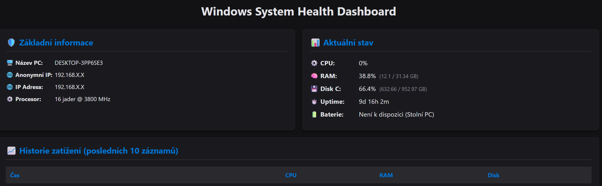

# Windows System Health Dashboard

A lightweight, local web-based dashboard designed to monitor Windows system stability and performance metrics in real-time. Built with Python, Flask, and SQLite.

## 📱 Features

- **🛡️ System Overview**: Hostname, exact Windows version, anonymized local IP address, and processor details.
- **⚙️ Live Hardware Metrics**: Real-time CPU, RAM, and Disk utilization updated every 3 seconds via AJAX.
- **⏱️ System Status**: Uptime logging and laptop battery level/charging status tracking.
- **📈 Historical Logs**: Automatic background worker that saves system metrics into a local SQLite database every 60 seconds.
- **🔒 Privacy First**: Local IP addresses are automatically anonymized (`192.168.X.X`) to prevent sensitive network leaks during sharing or demonstration.

## 📸 Preview



## 🛠️ Technology Stack

- **Backend:** Python 3.x, Flask (Web server), Threading (Background worker)
- **Data Collection:** `psutil`, `platform`, `socket`
- **Database:** SQLite (Native Python `sqlite3`)
- **Frontend:** HTML5, CSS3 (Modern dark mode grid layout), Vanilla JavaScript (Fetch API)

## 🚀 Getting Started

### Prerequisites
Make sure you have Python 3 installed on your Windows machine.

### Installation

1. **Clone the repository:**
   ```bash
   git clone https://github.com
   cd Windows-System-Health-Dashboard
   ```

2. **Create and activate a virtual environment:**
   ```bash
   python -m venv venv
   .\venv\Scripts\Activate.ps1
   ```

3. **Install dependencies:**
   ```bash
   pip install -r requirements.txt
   ```

### Running the Application

Start the Flask server by running:
```bash
python app.py
```

Open your browser and navigate to: **`http://127.0.0.1:5000`**

## 📂 Project Structure

```text
Windows-System-Health-Dashboard/
│
├── app.py              # Application core and background logging thread
├── config.py           # Application settings and paths
├── database.py         # SQLite connection and helper functions
├── monitor.py          # Windows hardware metrics collector
├── requirements.txt    # Project dependencies
├── .gitignore          # Git exclusion rules
│
├── database/           # Folder for local SQLite storage (ignored by git)
│   └── health.db
├── screenshots/        # Project preview screenshots
│   └── dashboard.png
├── static/             # Frontend assets
│   └── style.css
└── templates/          # Jinja2 HTML templates
    ├── base.html
    └── index.html
```
